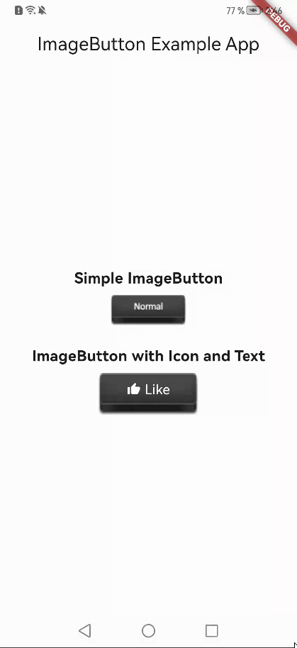

# ImageButton

A customizable button widget composed of two images.

## About

ImageButton is a simple plugin that allows you to create buttons using images with two states:
pressed and unpressed. It is designed for use cases where you want a button that visually responds
to user interaction with images.

---

## How to Use ImageButton

```dart
Widget build(BuildContext context) {
  return ImageButton(
    child: Row(
      children: [
        Icon(Icons.star, color: Colors.white),
        Text("Click Me", style: TextStyle(color: Colors.white))
      ],
    ),
    width: 100,
    height: 50,
    pressedImage: Image.asset("assets/pressed.png"),
    unpressedImage: Image.asset("assets/unpressed.png"),
    onTap: () {
      print('Button pressed!');
    },
  );
}
```

---

## ImageButton Properties

| Property             | Type                 | Description                                                                                |
|----------------------|----------------------|--------------------------------------------------------------------------------------------|
| `child`              | `Widget?`            | Custom widget to display inside the button. Preferred over `children`.                     |
| ~~`children`~~       | `List<Widget>`       | Widgets to be displayed inside the button (deprecated, use `child` instead).               |
| `unpressedImage`     | `Image`              | The image displayed when the button is not pressed.                                        |
| `pressedImage`       | `Image`              | The image displayed when the button is pressed.                                            |
| `label`              | `Widget?`            | An optional label widget displayed below the button.                                       |
| `onTap`              | `VoidCallback?`      | Callback function triggered when the button is tapped.                                     |
| `width`              | `double?`            | Width of the button.                                                                       |
| `height`             | `double?`            | Height of the button.                                                                      |
| `mainAxisAlignment`  | `MainAxisAlignment`  | How the children are aligned horizontally. Default is `MainAxisAlignment.center`.          |
| `crossAxisAlignment` | `CrossAxisAlignment` | How the children are aligned vertically. Default is `CrossAxisAlignment.center`.           |
| `isEnabled`          | `bool`               | Determines if the button is interactable. Default is `true`.                               |
| `isLoading`          | `bool`               | Shows a loading indicator if set to `true`. Default is `false`.                            |
| `loadingIndicator`   | `Widget?`            | Custom widget to show as the loading indicator. Defaults to `CircularProgressIndicator()`. |
| `loadingColor`       | `Color?`             | Color of the loading indicator if `isLoading` is set to `true`. Defaults to `null`.        |

---

## Example Use Case

Here is an example showcasing how to use `ImageButton` in a practical scenario:

```dart
import 'package:flutter/material.dart';
import 'package:imagebutton/imagebutton.dart';

void main() => runApp(MyApp());

class MyApp extends StatelessWidget {
  @override
  Widget build(BuildContext context) {
    return MaterialApp(
      home: Scaffold(
        appBar: AppBar(title: Text("ImageButton Example")),
        body: Center(
          child: ImageButton(
            child: Row(
              children: [
                Icon(Icons.thumb_up, color: Colors.white),
                SizedBox(width: 5),
                Text("Like", style: TextStyle(color: Colors.white))
              ],
            ),
            width: 120,
            height: 50,
            pressedImage: Image.asset("assets/button_pressed.png"),
            unpressedImage: Image.asset("assets/button_unpressed.png"),
            isLoading: false,
            onTap: () {
              print("Button Pressed");
            },
          ),
        ),
      ),
    );
  }
}
```

---

## Example Animation

Below is an example animation of the ImageButton in action:



---

## Contributions

Contributions are welcome! Feel free to fork the repository and submit a pull request for any
enhancements or bug fixes.

---

## License

This project is licensed under the MIT License. See the `LICENSE` file for details.
